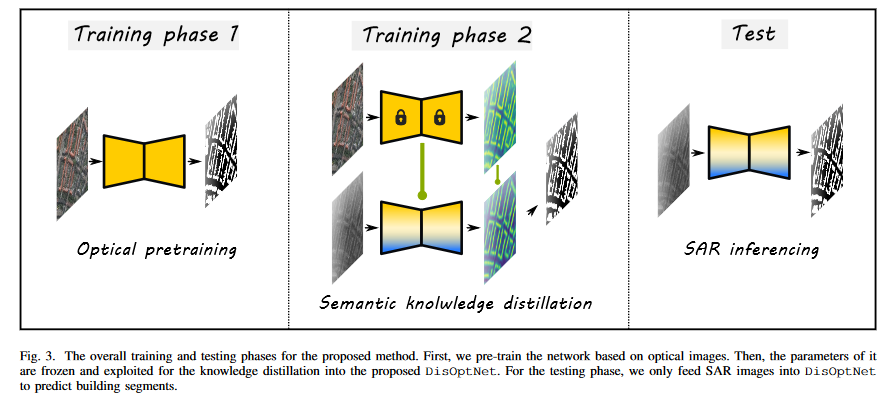

# DisOptNet: Distilling Semantic Knowledge from Optical Images for Weather-independent Building Segmentation

---

[Jian Kang](https://github.com/jiankang1991), Zhirui Wang, Zhirui Wang, [Junshi Xia](https://www.geoinformatics2018.com/member/junshixia/), [Xian Sun](http://people.ucas.ac.cn/~sunxian), [Ruben Fernandez-Beltran](https://scholar.google.es/citations?user=pdzJmcQAAAAJ&hl=es), [Antonio Plaza](https://www.umbc.edu/rssipl/people/aplaza/)

This repo contains the codes for the TGRS paper: [DisOptNet: Distilling Semantic Knowledge from Optical Images for Weather-independent Building Segmentation](https://ieeexplore.ieee.org/document/9750128). Compared to optical images, the semantics inherent to SAR images are less rich and interpretable due to factors like speckle noise and imaging geometry. In this scenario, most state-of-the-art methods are focused on designing advanced network architectures or loss functions for building footprint extraction. However, few works have been oriented towards improving segmentation performance through knowledge transfer from optical images. In this paper, we propose a novel method based on the DisOptNet network which can distill the useful semantic knowledge from optical images into a network only trained with SAR data. 


<p align="center">

</p>

## Data

We use the [SpaceNet6 dataset](https://spacenet.ai/sn6-challenge/) in the paper. The dataset preparation is based on the [SpaceNet6 baseline repo](https://github.com/CosmiQ/CosmiQ_SN6_Baseline).

```bash
|-- data
    |-- train.csv, valid.csv # sar train and validation tiles
    |-- opticaltrain.csv, opticalvalid.csv # optical train and validation tiles
```
## Usage

```
# first stage training (RGB)
./run_st1.sh
# second stage training (SAR+RGB)
./run_st2.sh
```

## Model weights

[DisOptNet-B4](https://drive.google.com/drive/folders/1QLyEPgiOaVn42zcXVv0qSQBeIz0jEGQ4?usp=sharing)

[DisOptNet-B3](https://drive.google.com/drive/folders/1RxWf7VE4BNAtDC7RQH7bkhujE9qh2gQu?usp=sharing)

## Citation

```
@article{kang2021RiDe,
  title={DisOptNet: Distilling Semantic Knowledge from Optical Images for Weather-independent Building Segmentation},
  author={Kang, Jian and Wang, Zhirui and Zhu, Ruoxin and Xia, Junshi and Sun, Xian and Fernandez-Beltran, Ruben and Plaza, Antonio},
  journal={IEEE Transactions on Geoscience and Remote Sensing},
  year={2022},
  note={DOI:10.1109/TGRS.2022.3165209}
  publisher={IEEE}
}
```


